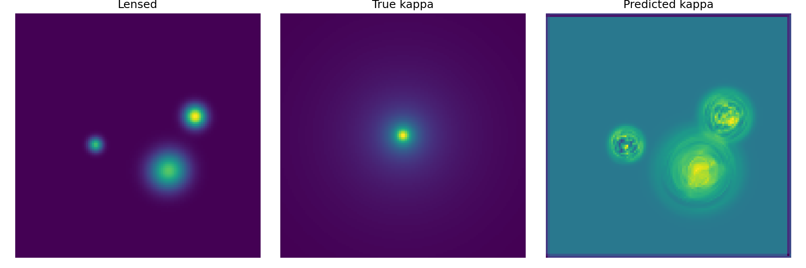
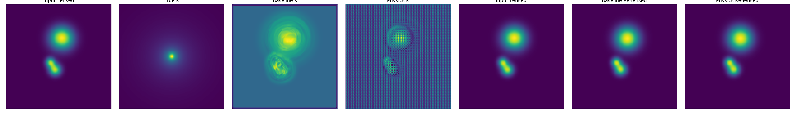
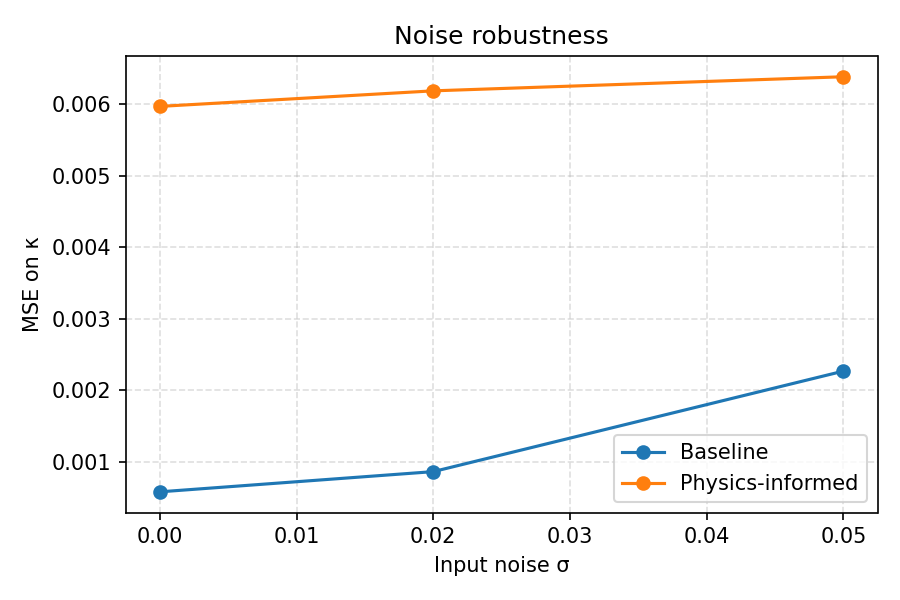

# Physics-Informed Gravitational Lensing Inverse Modeling

A compact, end-to-end framework for reconstructing a **convergence map** (mass density κ) from a **gravitationally lensed image**, using differentiable physics and deep learning.

The core idea is to enforce the lens equation via a loss that couples the predicted mass map with the predicted lensing deflection.

---

## Features

- **Synthetic lensing generation** (SIS and simplified NFW mass profiles)
- **FFT-based Poisson solver**: solve

  $$\nabla^2 \psi = \kappa$$

- **Deflection field**:

  $$\boldsymbol{\alpha} = \nabla \psi$$

- **Lens equation** (ray tracing):

  $$\mathbf{x}_s = \mathbf{x}_i - \boldsymbol{\alpha}(\mathbf{x}_i)$$

- **Models**: baseline CNN and U-Net
- **Physics-informed loss** that enforces consistency between the predicted κ and produced lensed image

---

## Requirements

Install dependencies:

```bash
pip install -r requirements.txt
```

---

## Running the full pipeline

Run the full physics-informed workflow (data generation, training, evaluation):

```bash
python main.py --mode train_physics
```

Other modes:

```bash
python main.py --mode train_baseline
python main.py --mode compare
python main.py --mode noise
```

Outputs are saved in:

- `plots/` — generated figures
- `checkpoints/` — model weights

---

## Project structure

```
.
├── README.md
├── REPORT.md
├── requirements.txt
├── main.py
├── .gitignore
├── plots/
├── checkpoints/
└── lensing/
    ├── config.py
    ├── data/
    │   ├── mass_profiles.py
    │   ├── source_generator.py
    │   └── lensing_simulation.py
    ├── physics/
    │   ├── poisson_solver.py
    │   ├── deflection.py
    │   └── lens_equation.py
    ├── models/
    │   ├── baseline_cnn.py
    │   └── unet.py
    ├── training/
    │   ├── train_baseline.py
    │   └── train_physics_informed.py
    ├── utils/
    │   ├── dataset.py
    │   ├── metrics.py
    │   └── visualization.py
    └── experiments/
        ├── compare_models.py
        └── noise_robustness.py
```

---

## Results (sample outputs)

After training, the pipeline saves visualization outputs under `plots/`.

### Example outputs

#### Baseline model (predicted κ)



#### Physics-informed model (predicted κ + re-lensed)


#### Model comparison



#### Noise robustness



> Note: `plots/` is tracked in this repo, but regenerated images may change after retraining.

---

## Read the report

A detailed report is available in `REPORT.md`. It includes:

- mathematical formulation of the lensing inverse problem
- implementation details for the FFT Poisson solver and lensing pipeline
- training setup, loss definitions, and hyperparameters
- evaluation results and error analysis
- discussion of limitations and possible extensions

---

## Configuration

Edit `lensing/config.py` to change:

- dataset size, image resolution, and noise
- training hyperparameters (epochs, learning rate, λ for physics loss)
- model channel widths

Then rerun:

```bash
python main.py --mode train_physics
```

---

## Running specific components

### Train the baseline model

```bash
python main.py --mode train_baseline
```

### Train the physics-informed model

```bash
python main.py --mode train_physics
```

### Compare models

```bash
python main.py --mode compare
```

### Noise robustness

```bash
python main.py --mode noise
```

---

## Notes

- The code is designed to be modular and easy to extend.
- For faster training, use a GPU and ensure `torch.cuda.is_available()` returns true.

---

## License

Add a `LICENSE` file to clarify reuse terms.
